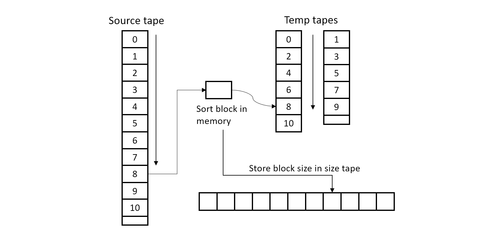
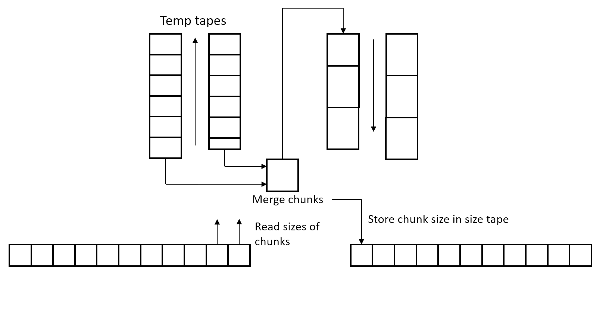

# Tape Sorter
A program for sorting tape-like files containing integers.

## Building
```
mkdir build && cd build
cmake ../
make -j tape_sorter
```

## Testing
You can run all tests or partial ones.
```
make -j test_all
./test_all

make -j test_tape
./tape/tests/test_tape
```
Or run script.
```
./gen_and_check.sh path/to/tape_sorter file-size mem-size
```

## Usage
```
Usage: ./tape_sorter src-file dst-file [MEMSIZE]
```
Configuration file tape.cfg in format: read-lat write-lat move-lat rewind-lat

## Algorithm Description
First, the source tape is divided into blocks and each block is loaded into memory and sorted. The block is then written to one of two temporary tapes. Also, its size is recorded in the size tape.



After the blocks are distributed, the direction of movement along the tapes is reversed and the last two loaded blocks are read from the two tapes and merged. The resulting larger block is loaded into one of the other two temporary tapes. This continues until all the blocks are merged in pairs.



Then the pairs of tapes are swapped and repeated until there is one block in the tapes. At the end, the two tapes merge into the destination tape.

### Complexity
Assuming that the characteristic time of access to a tape is $t$, and to memory $m$, the size of the tape is $n$, the size of the memory block is $b$. Sorting all blocks in memory is
$$m \cdot b \cdot log(b) \cdot (n/b) = m \cdot n \cdot log(b)$$
Merge two tapes until the end is
$$t \cdot n \cdot log(n/b) = t \cdot n \cdot (log(n)-log(b))$$
Result: $$O(n \cdot ((m-t) \cdot log(b) + t \cdot log(n)))$$
If $b=n$ we get $O(nlog(n))$ with constant $m$.
If $b=1$ we get $O(nlog(n))$ with constant $t$.